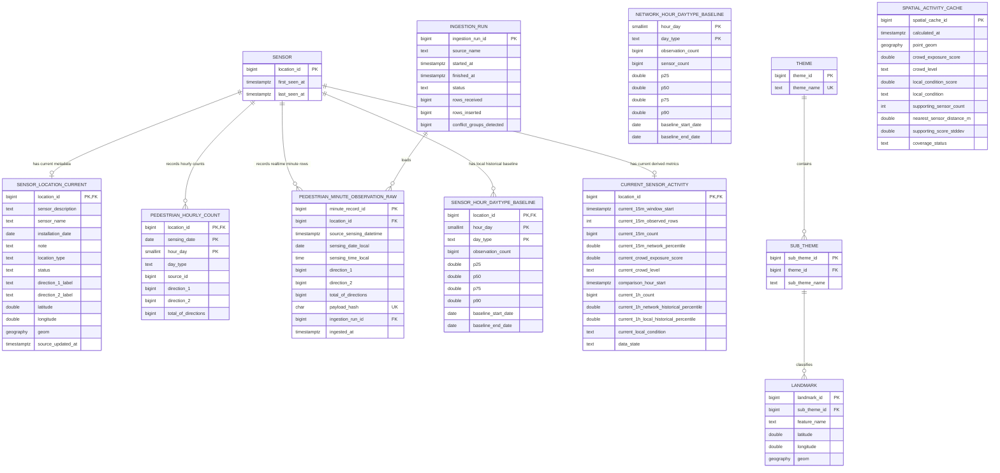

# Latest ERD — Epic 1 Backend V2

## V2 Design Notes

1. `CURRENT_SENSOR_ACTIVITY` no longer stores MAX/conservative Crowd Scores.
2. `current_15m_network_percentile` is the primary live Crowd Exposure input.
3. `current_1h_local_historical_percentile` is retained separately for Local Condition.
4. `NETWORK_HOUR_DAYTYPE_BASELINE` is added for network-level historical QA/context.
5. `LANDMARK_NEAREST_SENSOR` remains excluded from the core model because the current method uses all eligible Outdoor sensors within the 300 m support limit.
6. `PEDESTRIAN_MINUTE_OBSERVATION_RAW` still preserves conflicting rows using a surrogate PK plus payload hash.
7. `SENSOR_LOCATION_CURRENT` remains a current snapshot, not an invented historical-location dimension.
8. `SPATIAL_ACTIVITY_CACHE` stores Crowd Exposure and Local Condition separately.
