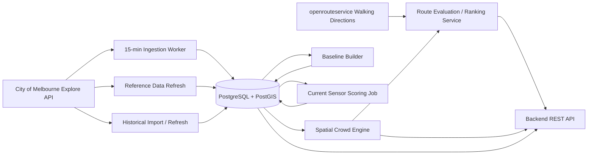

# Backend Architecture

## Processing Separation

### Scheduled jobs

- minute ingestion: every 15 min;
- current score materialisation: after successful minute ingestion;
- sensor metadata refresh: daily;
- historical hourly refresh: scheduled upsert;
- baseline rebuild: when historical data materially changes.

### Request-time services

- point crowd estimate;
- route geometry evaluation;
- walking-route candidate generation;
- route crowd metrics/ranking.

### Important

The routing service supplies **walkable geometry**.

The project crowd engine supplies **pedestrian activity evidence**.

Do not ask the routing engine to replace the project's sensor-derived crowd model.
